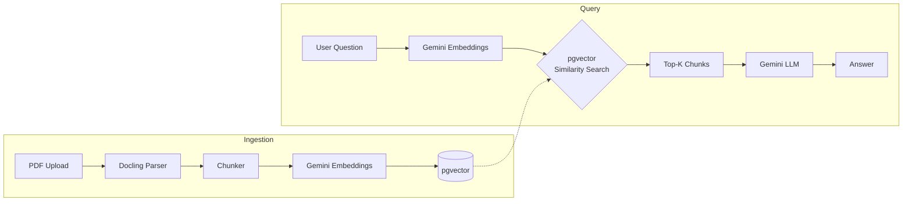

# doc-rag

A production-grade backend RAG (Retrieval-Augmented Generation) system that ingests PDF documents and answers questions based on their content. Built as a learning project for a financial mathematics bachelor thesis workflow.

## Architecture

The system operates in two pipelines:

### Ingestion Pipeline (per document upload)

```
PDF Upload → Docling Parse → Chunk Text → Gemini Embed → Store in pgvector
```

1. **Parse**: Docling extracts structured text from PDFs, preserving tables and layout.
2. **Chunk**: Text is split into overlapping segments optimized for retrieval.
3. **Embed**: Each chunk is converted to a 768-dim vector via Gemini `text-embedding-004`.
4. **Store**: Chunks + vectors are persisted in PostgreSQL with pgvector.

### Query Pipeline (per user question)

```
Question → Gemini Embed → pgvector Similarity Search → Top-K Chunks → Gemini LLM → Answer
```

1. **Embed Query**: The question is embedded with the same model used during ingestion.
2. **Retrieve**: pgvector finds the top-K most semantically similar chunks.
3. **Generate**: Retrieved chunks + question are sent to Gemini for grounded answer synthesis.

### Architecture Diagram



## Tech Stack

| Component        | Technology                         |
|------------------|------------------------------------|
| Language         | Python 3.13                        |
| API Framework    | FastAPI                            |
| PDF Parsing      | Docling (ML-based layout analysis) |
| Embeddings       | Google Gemini `text-embedding-004` |
| LLM              | Google Gemini 2.0 Flash            |
| Vector Database  | PostgreSQL + pgvector              |
| ORM              | SQLAlchemy (async) + Alembic       |
| Containerization | Docker Compose                     |

## Project Structure

```
doc-rag/
├── Dockerfile
├── docker-compose.yml
├── alembic.ini
├── alembic/
│   └── versions/
├── app/
│   ├── __init__.py
│   ├── main.py             # FastAPI app, lifespan, middleware
│   ├── config.py           # Pydantic BaseSettings
│   ├── schemas.py          # Request/response Pydantic models
│   ├── dependencies.py     # FastAPI dependency injection
│   ├── routes.py           # All API endpoints
│   ├── parser.py           # Docling PDF → structured text
│   ├── chunker.py          # Text → overlapping chunks
│   ├── embeddings.py       # Gemini embedding client
│   ├── llm.py              # Gemini generation client
│   ├── database.py         # Async SQLAlchemy engine + session
│   ├── models.py           # SQLAlchemy ORM models
│   ├── repositories.py     # Database query methods
│   └── services/
│       ├── __init__.py
│       ├── ingestion.py    # Parse → chunk → embed → store
│       ├── retrieval.py    # Embed question → pgvector search
│       └── generation.py   # Retrieve context → LLM → answer
├── tests/
├── .env.example
├── pyproject.toml
└── README.md
```

## API Endpoints

| Method   | Path              | Description                      |
|----------|-------------------|----------------------------------|
| `POST`   | `/documents/`     | Upload and ingest a PDF          |
| `GET`    | `/documents/`     | List all ingested documents      |
| `GET`    | `/documents/{id}` | Get document details             |
| `DELETE` | `/documents/{id}` | Delete a document and its chunks |
| `POST`   | `/queries/`       | Ask a question against documents |

## Setup

### Prerequisites

- Docker and Docker Compose
- Google Gemini API key ([Get one here](https://aistudio.google.com/apikey))

### Environment Variables

Copy `.env.example` to `.env` and fill in the values:

```bash
cp .env.example .env
```

### Run

```bash
docker compose up --build
```

The API will be available at `http://localhost:8000`.
Interactive docs at `http://localhost:8000/docs`.

## License

MIT
